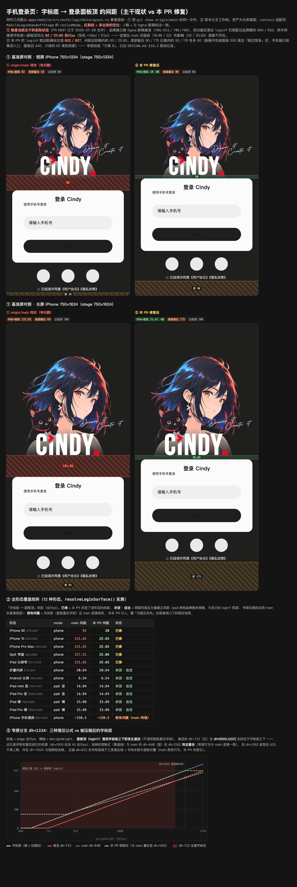

# mobile-login-panel-gap — 手机登录页「字标底 ↔ 面板顶」间距对照 demo

本 PR（手机端功能区落位回新稿标注值）的可交互证据，页面三块、全部由 `truth.json` 驱动（无手抄数字）：

1. **基准屏对照** — 短屏 750×1334 / 长屏 750×1624，主干现状 vs 本 PR 修复并排，红斜纹标出多余空白；
2. **全形态覆盖矩阵** — 12 种真机形态经 `resolveLoginSurface()` 实算，逐个标「已修 / 未变·自洽 / 既有问题」；
3. **窄屏落位公式曲线** — `dh<1334` 段三种公式（main `dh-640`、被否 `dh-712`、采纳的钳制式）与被压缩后的字标底同图，
   直观显示为什么 `dh-712` 被否（它在 dh∈[600,1222] 全段落到字标底之下 = 面板盖住字标）。

- 本地体验：浏览器直接打开 `index.html`（自包含，无需起服务）
- **不想 clone 也能看**：下面这张就是 `index.html` 的渲染截图（GitHub 上 `.html` 只显示源码、不会渲染，故入库一张目检图）



图内含上述三块：①基准屏对照（左列红斜纹 = 主干多出的空白 92 / 131.65，右列绿框 ✓稿 = 修复后回到稿内 20 / 25.65）、
②全形态覆盖矩阵、③窄屏公式曲线。

## 看什么

| 列 | 来源 | 字标↔面板 | 底部留白 |
|---|---|---|---|
| ① origin/main 现状 | `git show origin/main:apps/mobile/src/auth/loginSkinLayout.ts` | **短 92 / 长 131.65**（红斜纹） | 18 / 69 |
| ② 本 PR 修复后 | 本分支工作树同一文件 | **短 20 / 长 25.65** ✓稿 | 90 / 175 |

**① 就是 PR #697 合并后主干的实际状态**：品牌簇已换 figma 新稿基准（`705:915` / `705:799`），
但功能区落位 `loginY` 仍是配旧品牌簇算出来的 694 / 933，两半拼接使字标底与面板顶之间空出
92 / 131.65 设计px（实机 ≈38pt / 57pt，约半个输入框高）。该值在 main 改版前（18.98 / 22）
与新稿（20 / 25.65）里都不存在 —— 它是"上半换了稿、下半没换"的产物。

② 把 `loginY` 取回新稿标注值 622 / 827，间距回到稿内值。**底部留白 90 / 175 比稿内的
30 / 115 各多 60**：新稿手机帧的面板是 500 高（含面板内「跳过登录」栏），手机端已按产品
决定剥离该入口、面板回 440，少掉的 60 全部落到底部留白 —— 审图拍板「方案 B」，取舍与
被否的方案 A（品牌簇整体下移 60）记录在 `DESIGN.md §16.2`「面板 500→440 少掉的 60 去向」。

## 真值来源（禁手抄）

`truth.json` 的每个几何值都由 `extract.mjs` 从产品源码机械提取，两列共用同一把尺子：

- **当前列**：直接 `import` 仓库工作树的 `apps/mobile/src/auth/loginSkinLayout.ts`
  （该文件是纯数据 / 纯函数、零 react-native，node 可直接加载）
- **main 列**：`git show origin/main:<同一路径>` 取出源码文本后同样 `import`
- **稿值参照**：`figmaLoginY` / `figBottomGap` 取自 `docs/design-rules/figma-component-spec.md`
  §12 表 wave6 的逐值记录（短屏 `705:915` Log_in 组 @(35,622)、长屏 `705:799` @(35,827)；
  主容器 680×882 → 短屏底距 30 / 长屏底距 115）
- **面板内几何**（标题 / 副标题 / 输入框 / 主按钮 / 圆钮行 / 协议行）：取同文件的
  `LOGIN_GROUP` / `LOGIN_TITLE` / `LOGIN_SUBTITLE` / `LOGIN_CONTROL` / `LOGIN_SOCIAL` /
  `LOGIN_CONSENT_ROW`，两列同源（手机端面板几何本 PR 未动）
- **底距用的「`loginY` 之下内容总高」也是推导值**，不写死：`contentBelowLoginY()` 取协议行底
  （`LOGIN_CONSENT_ROW.y + .height`），并与另一条独立路径（`LOGIN_GROUP.height +
  .bottomOverflow`）交叉断言；面板几何将来若变而两条路径分叉，提取直接抛错，
  而不是继续输出一份底距算错却看着正常的 demo

## 复现 / 更新

在**仓库根**执行（Node 22+；`extract.mjs` 依赖 `esbuild` 转译 TS，已在仓库 devDeps 内）：

```bash
D=docs/design-previews/mobile-login-panel-gap
node $D/extract.mjs "$PWD" > $D/truth.json   # 重新提取两列真值
node $D/render.mjs  "$PWD"                   # 由 truth.json 重新生成 index.html
```

`origin/main` 前进后重跑即可 —— 本 PR 合并进 main 后，① 列会与 ② 列收敛（间距同为 20 / 25.65），
那正是修复生效的标志。

## 局限（如实说明）

- **不是 qa-hifi-demo 工具链的产物**：没有 `spec.json` / `report.json`，也没走
  `truth.mjs --check/--embed` 的 provenance 嵌入与 playwright 自检。这是针对"两半拼接导致
  间距漂移"这一个具体缺陷的定向对照 demo，只覆盖几何落位，不覆盖登录链路的状态机 / 交互 /
  多语言 / 双模式。
- **静态渲染，不是真机截图**：按 750 设计坐标系 ×0.62 显示，资产用 `object-fit: contain`
  与 `MobileLoginHandoffStage` 的 `resizeMode="contain"` 同口径；面板内控件为按真值定位的
  简化表示（用于量间距，不用于评审控件视觉）。深色底 `#1F1F1E` 与面板 `#FBFBFB` 取
  `DESIGN.md §16` 新稿帧底与面板色。
- **只覆盖两档基准屏**：`dh<1334` 的压缩分支与 `1334..1624` 的插值段不在图里，由
  `loginSkinLayout.test.ts` 的三条不变式（间距上界 / 锚常量连续性 / 短屏以下分支不压盖）守护。
- `evidence/shot-both-main-vs-fix.png` 是 `index.html` 的目检截图（Chrome headless，`--force-device-scale-factor=1`，1120×1900），随模板/真值变化需重截；它只是"不用 clone 也能看"的入口，**判定依据仍是 `index.html` + `truth.json`**。
- `assets/` 是 `apps/mobile/assets/login/` 的 `@2x` 副本（`hero.png` / `slogan-dark.png` /
  `wordmark-dark.png`），为让 demo 脱离仓库也能打开；产品真源以 `apps/mobile/assets/login/` 为准。
